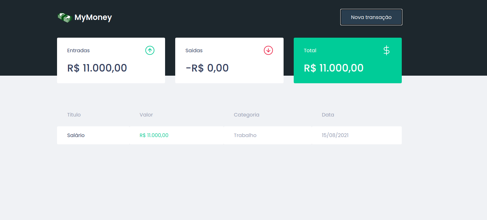
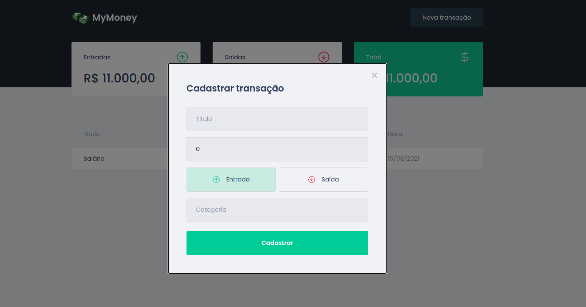

<div align="center">

  # :money_with_wings: MyMoney

  <p align="center">
    
    
    
  </p>
</div>

# :barber: About this project
MyMoney is an app to register cash in and out, built with **React.js** technology using **Typescript**, its styling was done with css using the **Styled-components** library, a fake API was used in the project through the **MirageJS** library and the requests in this API were made with the **Axios** library.

# :rocket: Main technologies

- [TypeScript](https://www.typescriptlang.org/docs/)
- [ReactJS](https://pt-br.reactjs.org/)
- [Axios](https://github.com/axios/axios)
- [Styled-Components](https://styled-components.com/)
- [MirageJS](https://miragejs.com/)
- [React-modal](https://github.com/reactjs/react-modal)

# :zap: How to run this project
```bash
# Clone this project to your local machine
$ git clone https://github.com/jefferson1104/mymoney-reactjs.git

# Go to the project directory and open it with your code editor(VSCODE)
cd mymoney-reactjs
code .

# Install all project dependencies
$ yarn

# Start locally at port 3000
$ yarn start
```

# 🎨 Screenshots
<p align="center">
  <a href='./src/assets/screenshots/mymoney-screenshot-01.png'>
    
  </a>

  <a href='./src/assets/screenshots/mymoney-screenshot-02.png'>
    
  </a>

  <a href='./src/assets/screenshots/mymoney-screenshot-03.png'>
    
  </a>
</p>

# Layout this project
https://www.figma.com/file/0xmu9mj2TJYoIOubBFWsk5/dtmoney-Ignite-(Copy)?node-id=0%3A1
